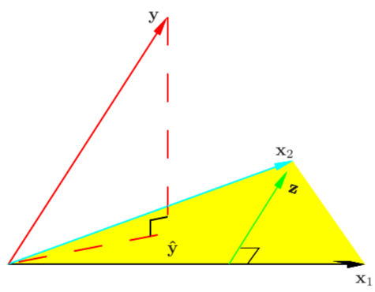
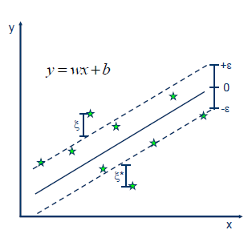

# 2 一个完整的机器学习流程框架

一般来说，一个完整的机器学习项目分为以下几个步骤：

- 明确任务类型：分类/回归/聚类...
- 收集数据集和标签数据，选择合适的特征
- 选择度量模型性能的指标
- 选择合适的模型，并进行训练、调参
- 评估模型性能

## 2.1 基于sklearn构建完整的回归项目

### 2.1.1 数据准备

```python
from sklearn import datasets
boston = datasets.load_boston()
X = boston.data
y = boston.target
features = boston.feature_names
boston_data = pd.DataFrame(X,columns=features)
boston_data["Price"] = y
print(boston_data.head())
```

### 2.1.2 评价指标

- 均方误差（Mean Square Error, MSE）
  - $\text{MSE}(y, \hat{y}) =\frac{1}{n} \sum\limits_{i=1}^{n} (y_i - \hat{y}_i)^2$
- 均方根误差（Root Mean Square Error, RMSE）
  - $\text{RMSE}(y, \hat{y}) =\sqrt{\frac{1}{n} \sum\limits_{i=1}^{n} (y_i - \hat{y}_i)^2}$
 - 平均绝对误差（Mean Absolute Error, MAE）
      - $\text{MAE}(y, \hat{y}) = \frac{1}{n} \sum\limits_{i=1}^{n} \left| y_i - \hat{y}_i \right|$
 - 可决系数（Coefficient of Determination, $R^2$）
      - $R^2(y, \hat{y}) = 1 - \frac{\sum_{i=1}^{n} (y_i - \hat{y}_i)^2}{\sum_{i=1}^{n} (y_i - \bar{y})^2}$
      - 可解释变异占总变异的比率（用离差表示）
 - 可解释方差（Explained Variance）
      - $\text{Explained_Variance}(y, \hat{y}) = 1 - \frac{Var\{ y - \hat{y}\}}{Var\{y\}}$
      - 给定数据中的变异能被数学模型所解释的部分（用方差表示）
      - 由于$Var\{ y - \hat{y}\}=E\{(y - \hat{y})^2\}-(E\{y - \hat{y}\})^2<=E\{(y - \hat{y})^2\}$，Explained Variance比$R^2$更大一些。

> 参考链接：https://scikit-learn.org/stable/modules/model_evaluation.html#regression-metrics

### 2.1.3 模型训练

假设：数据集$D = \{(x_1,y_1),...,(x_n,y_n) \}$，$x_i \in R^p,y_i \in R,i = 1,2,...,n$，$X = (x_1,x_2,...,x_n)^T,Y=(y_1,y_2,...,y_n)^T$ 

#### 2.1.3.1 线性回归模型

假设$X$和$Y$之间存在线性关系，模型的具体形式为：$\hat{Y}=Xw$    

也即：$Y=\hat{Y}+\varepsilon=Xw+\varepsilon$，其中$\varepsilon$表示误差。

我们通过最小化误差的平方和来估计模型的最优参数$w$（**最小二乘估计**）。

$$
\begin{align}
\min \ L(w)&=||Y-Xw||^2 \\
&=(Y-Xw)^T(Y-Xw) \\
&=Y^TY-2w^TX^TY+w^TX^TXw
\end{align}
$$

由于$L(w)$关于$w$是一个凸函数，根据一阶条件对$w$求偏导即可得到全局最优解。

$\frac{\partial{L(w)}}{\partial{w}}=2X^TXw-2X^TY=0 \Rightarrow   w=(X^TX)^{-1}X^TY$

**几何解释**

在线性代数中，我们知道两个向量a和b相互垂直可以得出：$<a,b> = a\cdot b = a^Tb = 0$,而平面X的法向量为$Y-Xw$，与平面X互相垂直，因此：$X^T(Y-Xw) = 0$，即：$w = (X^TX)^{-1}X^TY$ 。



**概率视角**

使用**极大似然估计**来对参数$w$进行估计，其核心思想是给定自变量$X$和参数$w$，出现观测值$Y$的概率最大。假设误差$\varepsilon$服从正态分布，$\varepsilon\backsim N(0,\sigma^2)$。

也即：
$$
\begin{align}
\max L(w) &=\log P(Y|X;w)\\
&= \log \prod_{i=1}^n P(y_i|x_i;w) \\
&= \sum\limits_{i=1}^{n} \log P(y_i|x_i;w)\\
&= \sum\limits_{i=1}^{n}\log(\frac{1}{\sqrt{2\pi}\sigma}\exp(-\frac{(y_i-w^Tx_i)^2}{2\sigma^2}))\\
&= \sum\limits_{i=1}^{n}[log(\frac{1}{\sqrt{2\pi}\sigma})-\frac{1}{2\sigma^2}(y_i-w^Tx_i)^2]
\end{align}
$$

$L(w)$关于参数$w$是一个凹函数，而最大化一个凹函数可以转化为最小化一个凸函数，也即：

$\min -L(w)=\sum\limits_{i=1}^{n}[(y_i-w^Tx_i)^2]+C$，其中$C$为一个常数。

该问题就转化成了最小二乘法问题。也就是说，**线性回归的最小二乘估计$\Leftrightarrow$噪声$\epsilon\backsim N(0,\sigma^2)$的极大似然估计**。

**计算机的最优值求解**

在实际使用过程中，当数据量非常庞大时，$(X^TX)$的逆运算会消耗大量的资源（$O(n^3)$），因此我们通常采用近似算法来逼近最优解。最小二乘法问题是一个无约束凸优化问题，因此我们可以直接使用梯度下降法进行拟合。其核心思路是：每次在梯度下降方向$-\nabla L(w^k)$走一小个步长$\alpha _k$，保证$L(w^{k+1})=L(w^{k})-\alpha _k\nabla L(w^k)\leq L(w^{k})$，则当搜索了足够多次时，模型能够收敛到全局最小值。

```python
from sklearn import linear_model      # 引入线性回归方法
lin_reg = linear_model.LinearRegression()       # 创建线性回归的类
lin_reg.fit(X,y)        # 输入特征X和因变量y进行训练
print("模型系数：", lin_reg.coef_)             # 输出模型的系数
print("模型得分：", lin_reg.score(X,y))    # 输出模型的决定系数R^2
```

#### 2.1.3.2 回归决策树模型

决策树模型的基本思路是按照特征的取值将特征空间划分为一系列简单的区域，每一个区域中的样本认为属于同一个类别。常见的三种决策树分类模型有ID3、C4.5、CART，分别采用了信息增益、信息增益率、基尼系数的指标来进行节点的分裂。

在CART中，作者提出了基于决策树的回归方法，也即回归树，其基本思路与分类决策树相同，对于一棵树，由于我们的标签不再是离散型的类别而是连续型的数值，因此自上而下地按照**最小化误差平方和**的方法进行节点的分裂。具体来说，我们首先将数据集下的所有所有样本按照标签从小到大排序，便历切分点，每个切分点将原有数据集分裂成两个子类，对于每一个子类，采用样本均值来表示该节点下所有样本的预测值（最小化误差平方和的解），计算两个子类的误差平方和总和。选取误差平方和最小的切分点。接着，计算每个类别中样本标签值与预测值的残差，输入下一层，继续进行分裂。最后的预测值为每一层预测值相加。

由于我们将每一个叶子节点上的所有样本的预测值设置为一样的，因此相当于使用一个分段函数来拟合任意一条曲线。当分段点足够多时，理论上分段函数能够拟合任意一条光滑曲线。

**树模型的优缺点**

- 优点：解释性强，对缺失值、异常值不敏感，效率高
- 缺点：容易过拟合，不支持在线学习

```python
from sklearn.tree import DecisionTreeRegressor    
reg_tree = DecisionTreeRegressor(criterion="mse",min_samples_leaf=5)
reg_tree.fit(X,y)
print(reg_tree.score(X,y))
```

#### 2.1.3.3 支持向量机回归模型

SVR的基本思路是：找到一个超平面，上下有两条条带为$\varepsilon$的条带，假设在两条条带之内的数据点预测正确（误差为0），希望最小化条带以外的数据点到条带边界的距离和。

也即：$L_{\varepsilon}(y,f(x,w))=\begin{cases} 0, & \text {if $|y-f(x,w)| \leq \varepsilon$} \\ |y-f(x,w)|-\varepsilon, & \text{otherwise} \end{cases}$

总体损失为$\min L(w)=\sum\limits_{i=1}^{n}L_{\varepsilon}(y,f(x,w))$。其中$f(x,w)=w^Tx+b$



设$y=wx+b+\varepsilon$上的点到该条带的距离为$\xi\geq 0$，$y=wx+b-\varepsilon$下的点到该条带的距离为$\xi^*\geq 0$。

则损失也可以写成$\min L(w)=\sum\limits_{i=1}^{n}(\xi_i+\xi_i^*)$，其中$\xi_i$和$\xi_i^*$中一个大于0时另一个必定为0，也即$\xi_i\xi_i^*=0$。（事实上，由于我们的模型是希望最小化$\xi_i$、$\xi_i^*$的和，最终收敛的结果一定满足该等式。）

与带软约束的SVC模型类似，我们加入$\frac{1}{2}||w||^2$作为正则项来防止过拟合，$C$为正则化系数。则总体模型为：

$$
\begin{align}
\min L(w)&=\frac{1}{2}||w||^2+C\sum\limits_{i=1}^{n}(\xi_i+\xi_i^*)\\
s.t. & 
\begin{cases}
y_i-(w^Tx_i+b)\leq \varepsilon+\xi,&i=1,...,n \\
(w^Tx_i+b)-y_i\leq \varepsilon+\xi^*,&i=1,...,n \\
\xi_i,\xi_i^* \geq 0,&i=1,...,n
\end{cases}
\end{align}
$$

引入拉格朗日乘子，根据KKT条间可以求得SVR的闭式解。

```python
from sklearn.svm import SVR
from sklearn.preprocessing import StandardScaler     # 标准化数据
from sklearn.pipeline import make_pipeline   # 使用管道，把预处理和模型形成一个流程

reg_svr = make_pipeline(StandardScaler(), SVR(C=1.0, epsilon=0.2))
reg_svr.fit(X, y)
print(reg_svr.score(X,y))
```


