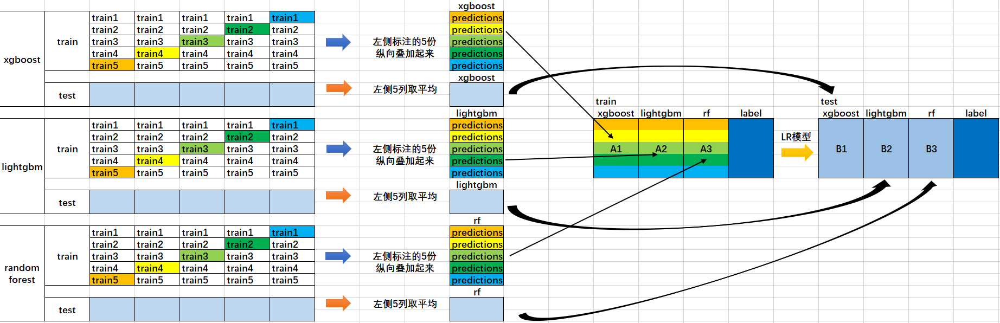

# Stacking

## Stacking原理

 在上节中我们提到，Blending最显著的缺点是集成过程中只使用到了验证集的数据，对数据造成了很大的浪费，同时容易对验证集的数据过拟合。

一种简单的改进方法是类似于交叉验证法，循环地抽取一部分数据作为验证集，再进行集成。

Stacking的过程如下：

例如，我们选择三种基学习器xgboost、lightgbm、random forest。

首先，对于每个基学习器，将训练集的数据分成K份，将K个验证集的预测结果堆叠起来，得到该基学习器的训练集集成特征。在测试集上对K个模型的预测结果取平均，得到该基学习器的测试集集成特征。

然后，将三个基学习器的训练集和测试集的集成特征分别纵向堆叠起来，训练一个模型，例如线性回归模型。

具体的示意图如下：



## Stacking实践

由于sklearn并没有直接对Stacking的方法，因此我们需要下载mlxtend工具包(pip install mlxtend)

> 在安装过程中出现问题 Cannot uninstall 'joblib'. 
>
> 解决方案是：
>
> pip install --ignore-installed joblib
>
> pip install mlxtend

### 基于预测值进行集成

**导入相关包**

```python
from sklearn.model_selection import cross_val_score
from sklearn.linear_model import LogisticRegression
from sklearn.neighbors import KNeighborsClassifier
from sklearn.naive_bayes import GaussianNB
from sklearn.ensemble import RandomForestClassifier
from mlxtend.classifier import StackingCVClassifier
from sklearn import datasets
import matplotlib.pyplot as plt
plt.style.use("ggplot")
```

**读入数据**

```python
iris = datasets.load_iris()
X, y = iris.data[:, 1:3], iris.target
```

**构建模型**

```python
RANDOM_SEED = 42
clf1 = KNeighborsClassifier(n_neighbors=1)
clf2 = RandomForestClassifier(random_state=RANDOM_SEED)
clf3 = GaussianNB()
lr = LogisticRegression()
sclf = StackingCVClassifier(classifiers=[clf1, clf2, clf3],  # 第一层分类器
                            meta_classifier=lr,   # 第二层分类器
                            random_state=RANDOM_SEED)
```

**结果对比**

```python
for clf, label in zip([clf1, clf2, clf3, sclf], ['KNN', 'Random Forest', 'Naive Bayes','StackingClassifier']):
    scores = cross_val_score(clf, X, y, cv=3, scoring='accuracy')
    print("Accuracy: %0.2f (+/- %0.2f) [%s]" % (scores.mean(), scores.std(), label))
```

> Accuracy: 0.91 (+/- 0.01) [KNN]
> Accuracy: 0.95 (+/- 0.01) [Random Forest]
> Accuracy: 0.91 (+/- 0.02) [Naive Bayes]
> Accuracy: 0.93 (+/- 0.02) [StackingClassifier]

### 基于预测概率进行集成

**构建模型**

```python
sclf = StackingCVClassifier(classifiers=[clf1, clf2, clf3],
                            use_probas=True,  # 
                            meta_classifier=lr,
                            random_state=42)
```

> Accuracy: 0.91 (+/- 0.01) [KNN]
> Accuracy: 0.95 (+/- 0.01) [Random Forest]
> Accuracy: 0.91 (+/- 0.02) [Naive Bayes]
> Accuracy: 0.95 (+/- 0.02) [StackingClassifier]

可以看到，使用概率作为元特征之后，模型总体性能有所提升。
