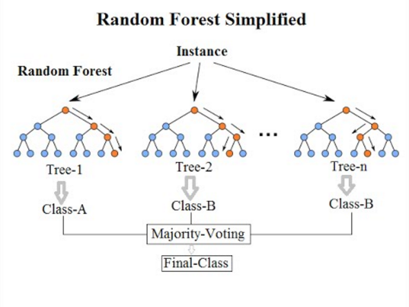

# Bagging

## Bagging的原理

我们在上一节提到，想要得到一个好的集成学习模型，基学习器应该“**好而不同**”。我们可以使用不同种类的机器学习模型、或者参数不同的同一种机器学习模型来作为基学习器，但是，在实际操作过程中，我们使用的模型通常是同质的。在这种情况下，如何能实现模型的“**多样性**”呢？

Bagging模型给出的思路是，对数据集进行多次采样，每次在采样集合上训练模型，这样纵使各个基学习器的模型结构是完全一样的，由于数据集的分布存在细微的差异，每个基学习器也会拥有细微不同的训练能力。

具体来说，Bagging模型的步骤如下：

- 从原始样本集中抽取训练集。每轮从原始样本集中使用Bootstrap的方法抽取n个训练样本（在训练集中，有些样本可能被多次抽取到，而有些样本可能一次都没有被抽中）。共进行k轮抽取，得到k个训练集。（k个训练集之间是相互独立的）
- 每次使用一个训练集得到一个模型，k个训练集共得到k个模型。（注：这里并没有具体的分类算法或回归方法，我们可以根据具体问题采用不同的分类或回归方法，如决策树、感知器等）
- 对分类问题：将上步得到的k个模型采用投票的方式得到分类结果；对回归问题，计算上述模型的均值作为最后的结果。（所有模型的重要性相同）

假设所有基分类器出错的概率是独立的，在某个测试样本上，使用简单多数投票的方法来集成结果，超过半数基分类器出错的概率会随着基分类器的数量增加而显著下降，从而减小了集成学习器的方法，增加了模型的泛化能力。

一种常见的Bagging算法是随机森林，它是由许多决策树进行Bagging组成的。在具体实现上，用于每个决策树训练的样本和构建决策树的特征都是通过随机采样得到的，随机森林的预测结果是多个决策树输出的组合（投票）。



使用决策树作为基分类器的优点在于：

- 决策树可以较为方便地将样本的权重整合到训练过程中，而不需要使用过采样的方法来调整样本权重。
- 决策树的表达能力和泛化能力，可以通过调节树的层数来做折中。
- 数据样本的扰动对决策树的影响较大，因此不同子样本集合生成的决策树基分类器随机性较大，这样的“不稳定学习器”多样性更高，更适合作为基分类器。此外，在决策树节点分裂的时候，随机地选择一个特征子集，从中找出最优分裂属性，很好地引入了随机性。

## Bagging的案例分析

与之前相似的，在iris数据集上进行实验。

**导入相关包**

```python
import pandas as pd
from sklearn import datasets
from sklearn.preprocessing import StandardScaler
from sklearn.pipeline import make_pipeline
from sklearn.model_selection import cross_val_score
from sklearn.tree import DecisionTreeClassifier
from sklearn.ensemble import BaggingClassifier
```

**读入数据**

```python
iris = datasets.load_iris()
X = iris.data
y = iris.target
feature = iris.feature_names
data = pd.DataFrame(X, columns=feature)
data['target'] = y
```

**构建模型**

对比决策树与随机森林模型。

```python
pipe_dt = make_pipeline(StandardScaler(), DecisionTreeClassifier())
bagging = BaggingClassifier()
models = [("dt", pipe_dt), ("bagging", bagging)]
```

**结果对比**

```python
def evaluate_model(model, X, y):
    score = cross_val_score(model, X, y, scoring='accuracy', cv=5, error_score='raise')
    return score
for (name, model) in models:
    score = evaluate_model(model, X, y)
    print(f"Model:{name}; Mean: {score.mean():.3f}; Std: {score.std():.3f}")
```

> Model:dt; Mean: 0.960; Std: 0.033
> Model:bagging; Mean: 0.967; Std: 0.021

可以看到，Bagging模型提高了预测准确率，也降低了预测方差。