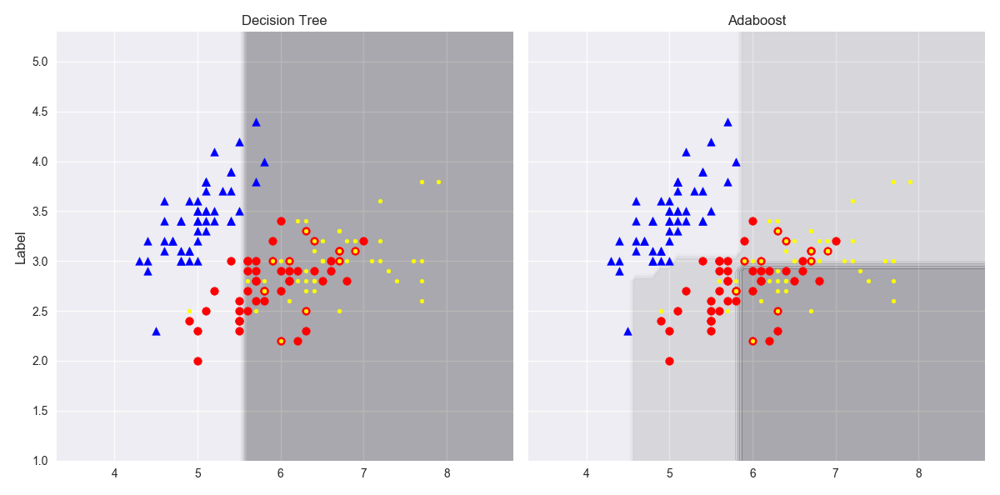

# Boosting

## Boosting的原理

Boosting方法使用同一组数据集进行反复学习，得到一系列简单模型。这些简单模型本身是弱学习器，且相互之间是强依赖的。然后将这些模型进行串行组合，得到一个预测性能更强大的机器学习模型。其主要是通过不断地减少偏差的形式来提高最终的预测结果。

Boosting方法最重要的两个问题是：

- 每一轮学习应该如何改变数据的概率分布  
- 如何将各个弱分类器组合起来  

## Adaboost的原理

Adaboost的基本思想是：将弱学习器层层累加，在每一层训练的时候，对前一层基分类器分错的样本给予更高的权重（调整数据的分布）。在测试时，根据各层分类器的结果加权得到最终预测结果。

这个过程很类似于人类学习的过程，也即“**从错误中学习**”，我们学习新知识的过程往往是迭代的，第一遍学习的时候，我们会记住一部分知识，但是往往也会犯一些错误。在进一步学习时，我们会对之前犯错的知识进行进一步的巩固，以减少此类错误的发生。如此不断循环往复，直到犯错误的次数减到很低的程度。

假设给定一个二分类的训练数据集：$T=\{\left(x_{1}, y_{1}\right),\left(x_{2}, y_{2}\right), \cdots,\left(x_{N}, y_{N}\right)\}$，其中每个样本点由特征与类别组成。特征$x_{i} \in \mathcal{X} \subseteq \mathbf{R}^{n}$，类别$y_{i} \in \mathcal{Y}=\{-1,+1\}$，$\mathcal{X}$是特征空间，$\mathcal{Y}$是类别集合，输出最终分类器$G(x)$。Adaboost算法如下：
(1) 初始化训练数据的分布：$D_{1}=\left(w_{11}, \cdots, w_{1 i}, \cdots, w_{1 N}\right), \quad w_{1 i}=\frac{1}{N}, \quad i=1,2, \cdots, N$
(2) 对于$m=1,2,...,M$

- 使用具有权值分布$D_m$的训练数据集进行学习，得到基本分类器：$G_{m}(x): \mathcal{X} \rightarrow\{-1,+1\}$
- 计算$G_m(x)$在训练集上的分类误差率$e_{m}=\sum_{i=1}^{N} P\left(G_{m}\left(x_{i}\right) \neq y_{i}\right)=\sum_{i=1}^{N} w_{m i} I\left(G_{m}\left(x_{i}\right) \neq y_{i}\right)$
- 计算$G_m(x)$的系数$\alpha_{m}=\frac{1}{2} \log \frac{1-e_{m}}{e_{m}}$，这里的log是自然对数ln
- 更新训练数据集的权重分布
$$
\begin{aligned} 
D_{m+1}&=\left(w_{m+1,1}, \cdots, w_{m+1, i}, \cdots, w_{m+1, N}\right) \\ 
w_{m+1, i}&=\frac{w_{m, i}}{Z_{m}} \exp \left(-\alpha_{m} y_{i} G_{m}\left(x_{i}\right)\right), \quad i=1,2, \cdots, N 
\end{aligned}
$$

这里的$Z_m$是规范化因子，使得$D_{m+1}$称为概率分布，$Z_{m}=\sum_{i=1}^{N} w_{m i} \exp \left(-\alpha_{m} y_{i} G_{m}\left(x_{i}\right)\right)$

(3) 构建基本分类器的线性组合$f(x)=\sum_{m=1}^{M} \alpha_{m} G_{m}(x)$，得到最终的分类器

$$
\begin{aligned} 
G(x) &=\operatorname{sign}(f(x)) \\ &=\operatorname{sign}\left(\sum_{m=1}^{M} \alpha_{m} G_{m}(x)\right) \end{aligned}
$$

## Adaboost的实践

**导入相关包**

```python
import pandas as pd
import numpy as np
from sklearn import datasets
from sklearn.model_selection import cross_val_score
from sklearn.tree import DecisionTreeClassifier
from sklearn.ensemble import AdaBoostClassifier
import matplotlib.pyplot as plt
plt.style.use("ggplot")
```

**读入数据**

```python
iris = datasets.load_iris()
X = iris.data
y = iris.target
feature = iris.feature_names
data = pd.DataFrame(X, columns=feature)
data['target'] = y
```

**构建模型**

```python
dt = DecisionTreeClassifier(criterion='entropy',random_state=1,max_depth=1)
ada = AdaBoostClassifier(base_estimator=dt,n_estimators=500,learning_rate=0.1,random_state=1)
models = [("dt", dt), ("adaboost", ada)]
```

为了方便对比，我们使用一层的决策树模型，该模型是一个较弱的分类器。

**结果对比**

```python
def evaluate_model(model, X, y):
    score = cross_val_score(model, X, y, scoring='accuracy', cv=5, error_score='raise')
    return score
    
for (name, model) in models:
    score = evaluate_model(model, X, y)
    print(f"Model:{name}; Mean: {score.mean():.3f}; Std: {score.std():.3f}")
```

> Model:dt; Mean: 0.667; Std: 0.000
> Model:adaboost; Mean: 0.947; Std: 0.034

可以看到虽然单层决策树的训练准确率较低，但是Adaboost算法能够有很高的性能提升。

**可视化**

为了更好地可视化，使用前两个维度的特征。

```python
X = X[:, :2]
x_min = X[:, 0].min() - 1
x_max = X[:, 0].max() + 1
y_min = X[:, 1].min() - 1
y_max = X[:, 1].max() + 1
xx, yy = np.meshgrid(np.arange(x_min, x_max, 0.1),np.arange(y_min, y_max, 0.1))
f, axarr = plt.subplots(nrows=1, ncols=2,sharex='col',sharey='row',figsize=(12, 6))
for idx, clf, tt in zip([0, 1],[dt, ada],['Decision Tree', 'Adaboost']):
    clf.fit(X, y)
    Z = clf.predict(np.c_[xx.ravel(), yy.ravel()])
    Z = Z.reshape(xx.shape)
    axarr[idx].contourf(xx, yy, Z, alpha=0.3)
    axarr[idx].scatter(X[y == 0, 0], X[y == 0, 1], c='blue', marker='^')
    axarr[idx].scatter(X[y == 1, 0], X[y == 1, 1], c='red', marker='o')
    axarr[idx].scatter(X[y == 2, 0], X[y == 2, 1], c='yellow', marker='.')
    axarr[idx].set_title(tt)
axarr[0].set_ylabel('Label', fontsize=12)
plt.tight_layout()
plt.show()
```



Adaboost模型的决策边界比单层决策树的决策边界要复杂的多。也就是说，Adaboost试图用增加模型复杂度而降低偏差的方式去减少总误差，但是过程中引入了方差，可能出现过拟合，因此在训练集和测试集之间的性能存在较大的差距。

